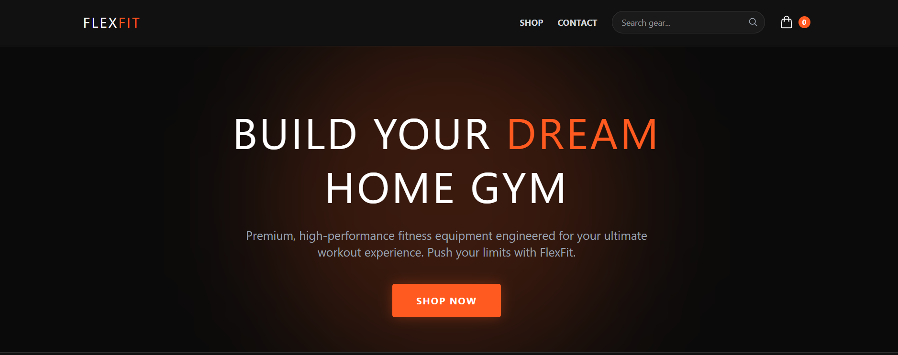
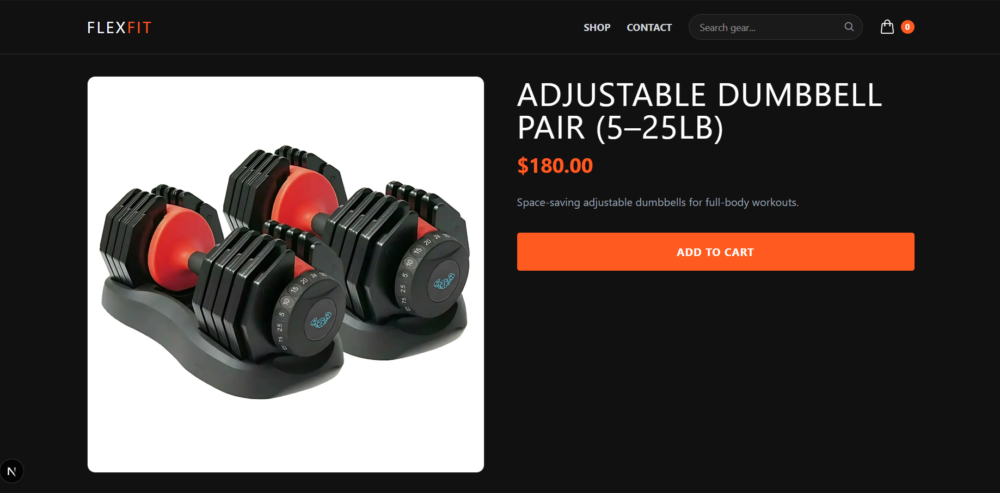
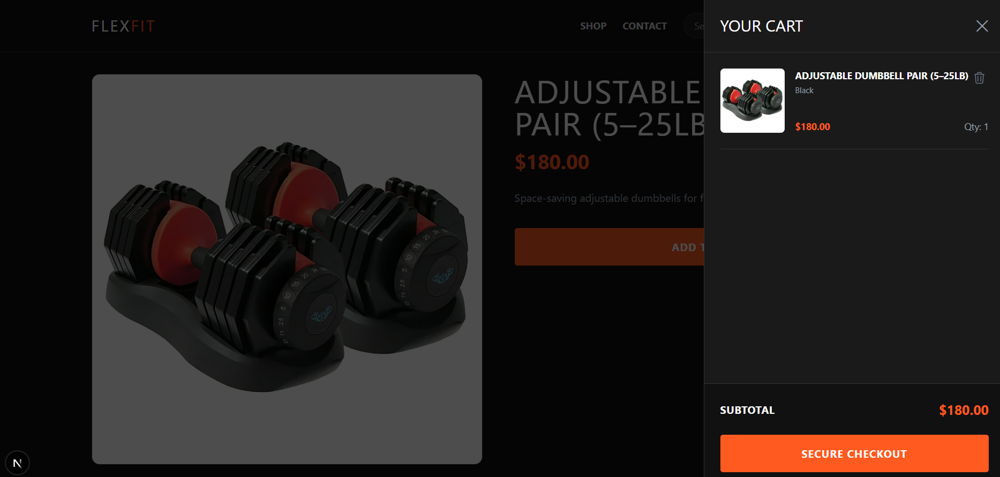
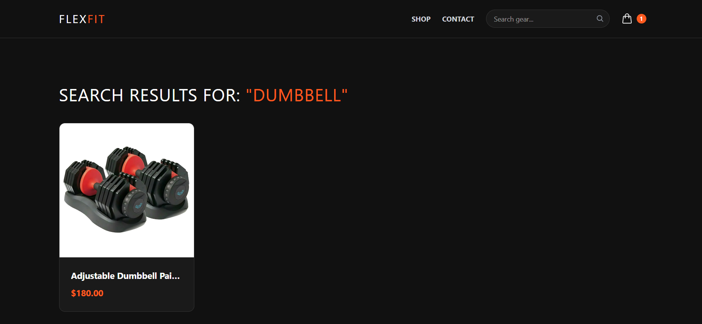
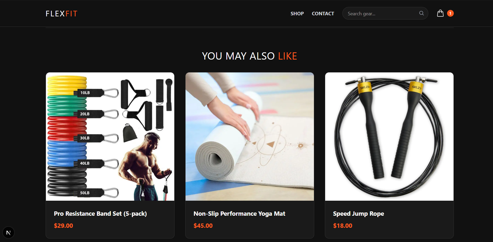
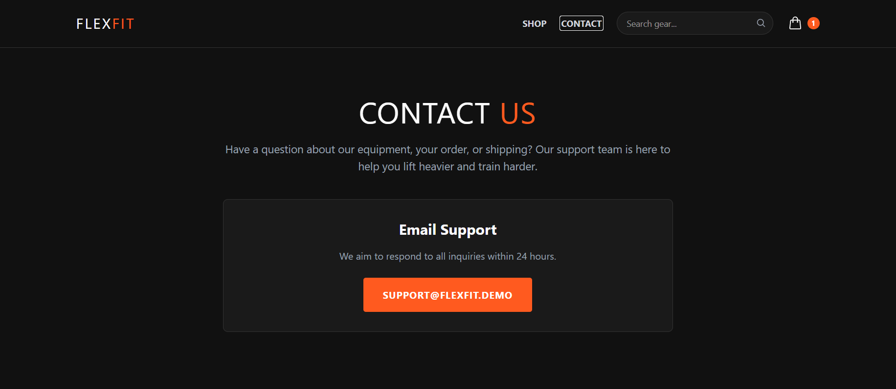
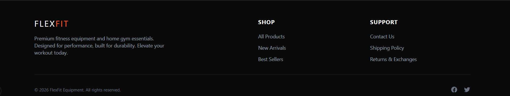

# FlexFit | Premium Headless E-Commerce Storefront

A high-performance, modern headless e-commerce application built with **Next.js 15 (App Router)** and the **Shopify Storefront API (GraphQL)**. Designed with a dark-themed, electric-orange fitness brand aesthetic, this platform delivers lightning-fast server-side rendering, secure server actions for cart management, and a seamless shopping experience.



## Core Architecture & Tech Stack

* **Framework:** Next.js 15 (React, Server Components, Server Actions)
* **Styling:** Tailwind CSS, Custom Typography (Inter & Archivo)
* **E-Commerce Backend:** Shopify Storefront API (GraphQL)
* **State & Session:** HTTP-only Secure Cookies for persistent cart management
* **UI Enhancements:** React Hot Toast notifications, Lucide/Heroicons, Custom Loading Skeletons
* **Deployment:** Vercel-ready with optimized caching and revalidation

---

## Key Features

* **Dynamic Hero & Product Catalog:** Immersive dark-mode landing page featuring a glowing hero section and responsive product grid.
* **Slide-Out Cart Drawer:** Real-time cart state management allowing users to update quantities, view subtotals, and remove items without page reloads.
* **Server-Powered Search:** Dedicated `/search` route leveraging Shopify GraphQL filters to find items instantly.
* **Related Products Engine:** "You May Also Like" recommendation system built into the product details page (PDP).
* **Advanced SEO Integration:** Dynamic metadata generation and OpenGraph tags per product using Next.js native `generateMetadata`.
* **Optimized UX:** Skeleton loaders (`loading.tsx`) and sleek confirmation toast notifications (`react-hot-toast`).

---

## Project Structure

```text
├── src/
│   ├── app/
│   │   ├── actions.ts          # Server actions for cart operations
│   │   ├── layout.tsx          # Root layout with global providers & header/footer
│   │   ├── page.tsx            # Homepage with hero & product grid
│   │   ├── contact/            # Static support page
│   │   ├── search/             # Dynamic search results page
│   │   └── products/
│   │       └── [handle]/       # Dynamic PDP & related products
│   ├── components/             # Modular UI components (CartDrawer, Header, Footer, AddToCart)
│   └── lib/                    # Shopify client, queries, and utilities
├── screenshots/                # Application preview images for documentation
└── .env.local                  # Environment configuration (ignored by git)
```

---

## Getting Started Locally

### 1. Clone the Repository

```bash
git clone https://github.com/ZainAbbas-dev/flexfit-storefront.git
cd flexfit-storefront
```

### 2. Install Dependencies

```bash
npm install
```

### 3. Configure Environment Variables

Create a `.env.local` file in the root directory and add your Shopify Storefront credentials:

```
SHOPIFY_STORE_DOMAIN=your-shopify-store.myshopify.com
SHOPIFY_STOREFRONT_ACCESS_TOKEN=your_storefront_access_token
```

### 4. Run the Development Server

```bash
npm run dev
```

Open [http://localhost:3000](http://localhost:3000) in your browser to view the store.

---

## Recommended Screenshots for the `screenshots/` Folder

To showcase the application effectively in your repository, place the following screenshots inside the root `screenshots/` directory:

* **Homepage Preview**: Captures the top hero banner with the "Build Your Dream Home Gym" title and the featured equipment grid.
  

* **Product Detail Page**: Highlights the single product layout, high-res imagery, product description, and the orange "Add to Cart" button.
  

* **Cart Drawer**: Shows the slide-out cart drawer open with line items, quantity counts, subtotal calculation, and the "Secure Checkout" button.
  

* **Search Results**: Displays the header search input active or results rendered on the `/search` page.
  

* **Related Products**: Focuses on the "You May Also Like" recommendation slider at the bottom of a product details page.
  

  * **Contact Us**: Showcases the dedicated customer support page with email inquiries and layout design.
  

* **Footer Section**: Displays the professional bottom section featuring quick links, store information, and policy navigation across all pages.
  
---

## License

Distributed under the MIT License. See `LICENSE` for more information.

---

### Screenshot Checklist for your Root `screenshots/` Directory:

1. **`homepage.png`** — Homepage showing the dark hero section and product grid.
2. **`product-detail.png`** — Single product page with description and add-to-cart action.
3. **`cart-drawer.png`** — Slide-out cart drawer containing added items and subtotal.
4. **`search-results.png`** — Search results view for keywords like "Band" or "Dumbbell".
5. **`related-products.png`** — Bottom recommendation grid on the PDP.